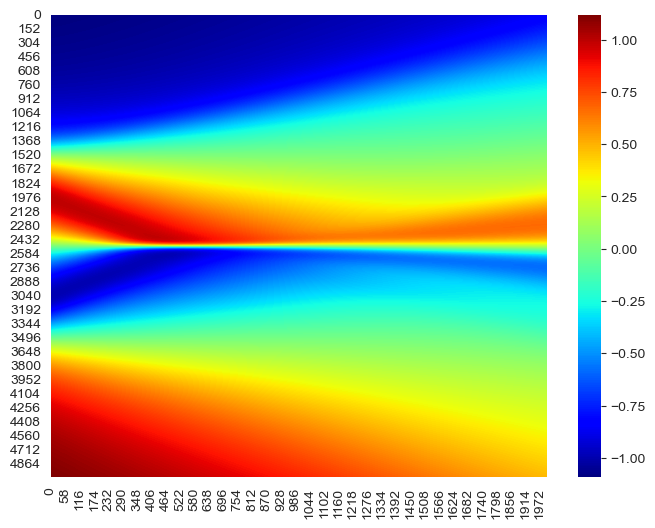
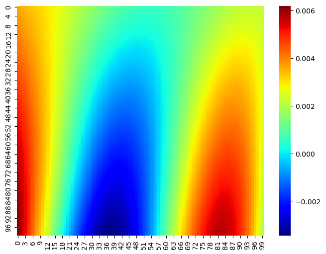
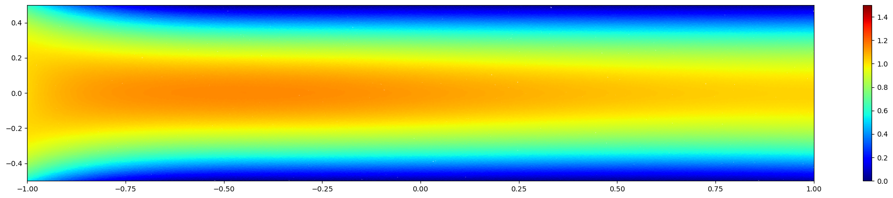

# PINNs — My Implementations

My own step-by-step **Physics-Informed Neural Network** implementations, written while working through Dr. Mohammad Samara's courses. The notebooks form a learning progression — from a first 1D heat solver up to 2D Navier–Stokes — mixing **from-scratch PyTorch** with **[DeepXDE](https://deepxde.readthedocs.io/)**, plus a finite-difference (FDM) reference for comparison.

<p align="center">
  <br>
  <em>Space–time solution of the 1D Burgers' equation (PyTorch PINN) — the characteristic shock forms at x = 0.</em>
</p>

---

## What a PINN minimizes

Each notebook trains a network $u_\theta$ whose derivatives (via autograd) are plugged into the PDE residual, together with initial/boundary terms:

$$\mathcal{L}(\theta)=\mathcal{L}_{\text{PDE}}+\mathcal{L}_{\text{BC}}+\mathcal{L}_{\text{IC}}$$

Governing equations used across the series:

$$\text{Burgers:}\quad u_t + u\,u_x = \nu\,u_{xx} \qquad\quad \text{Heat:}\quad u_t=\alpha\,(u_{xx}+u_{yy})$$

$$\text{Navier–Stokes:}\quad \nabla\cdot\mathbf{u}=0,\qquad \mathbf{u}_t+(\mathbf{u}\cdot\nabla)\mathbf{u}=-\tfrac{1}{\rho}\nabla p+\nu\nabla^2\mathbf{u}$$

## Projects (in learning order)

| # | Notebook | Problem | Approach |
|---|---|---|---|
| 1 | [`Erfan_heat_1.ipynb`](Erfan_heat_1.ipynb) | 1D heat (diffusion) equation | PyTorch (from scratch) |
| 2 | [`Burgers_2D_FDM_Erfan_2.ipynb`](Burgers_2D_FDM_Erfan_2.ipynb) | 2D Burgers' equation | Finite-difference reference |
| 3 | [`PINNS_1D_Burgers_Erfan_3.ipynb`](PINNS_1D_Burgers_Erfan_3.ipynb) | 1D Burgers' equation | PyTorch (from scratch) |
| 4 | [`PINNS_2D_Heat_Erfan_4.ipynb`](PINNS_2D_Heat_Erfan_4.ipynb) | 2D heat equation | PyTorch (from scratch) |
| 5 | [`DeepXDE_1D_Heat_Erfan_5.ipynb`](DeepXDE_1D_Heat_Erfan_5.ipynb) | 1D heat equation | DeepXDE |
| 6 | [`DeepXDE_2D_NS_Erfan_6.ipynb`](DeepXDE_2D_NS_Erfan_6.ipynb) | 2D Navier–Stokes flow | DeepXDE |

## Results

| | |
|:---:|:---:|
| <br><em>2D heat equation field (notebook 4)</em> | <br><em>2D Navier–Stokes u-velocity (notebook 6)</em> |

> `*.dat` files are training/evaluation logs produced by the DeepXDE notebooks.

## Tech stack

Python 3.9+ · [PyTorch](https://pytorch.org/) · [DeepXDE](https://deepxde.readthedocs.io/) · NumPy · Matplotlib

## Getting started

```bash
git clone https://github.com/erfant00001/pinns-my-implementations.git
cd pinns-my-implementations
pip install torch deepxde numpy matplotlib jupyter
jupyter notebook
```

Run the notebooks in numerical order to follow the progression.

## Acknowledgements

These projects were created while learning Physics-Informed Neural Networks and Scientific Machine Learning from the Udemy courses of **Dr. Mohammad Samara** (Data Science / Machine Learning expert; PhD, University of Tokyo).

Instructor profile: **https://www.udemy.com/user/mohammad-samara-18/**

The problem setups and course material are credited to the instructor. This repository contains my own implementations and notes produced while following the courses, shared for learning and reference.
